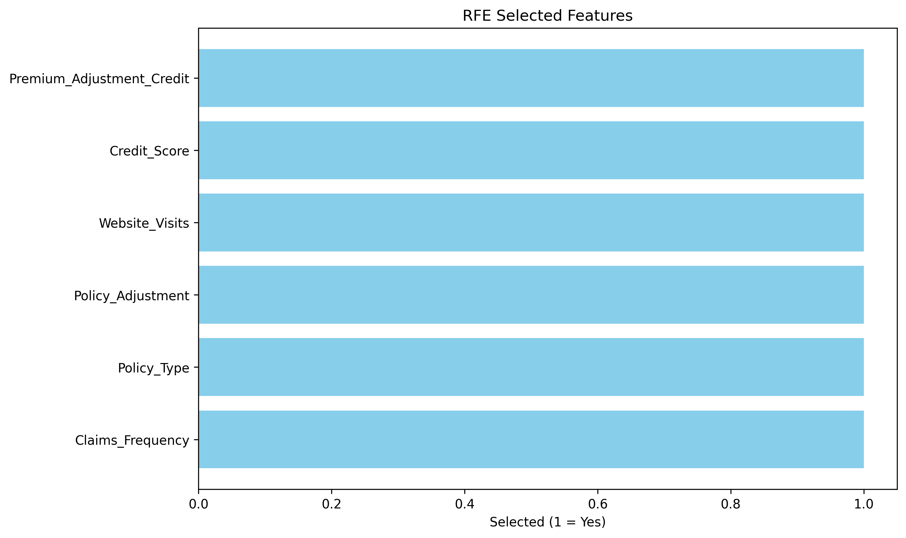
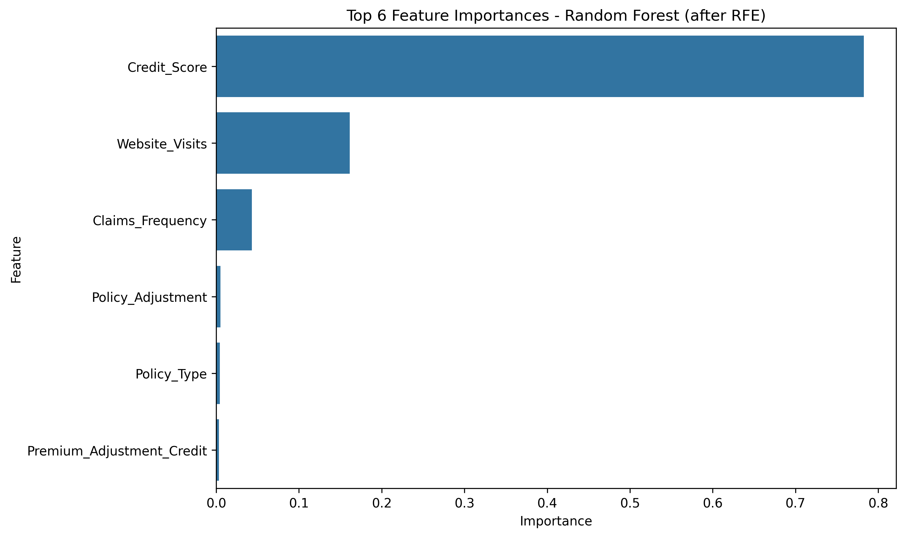
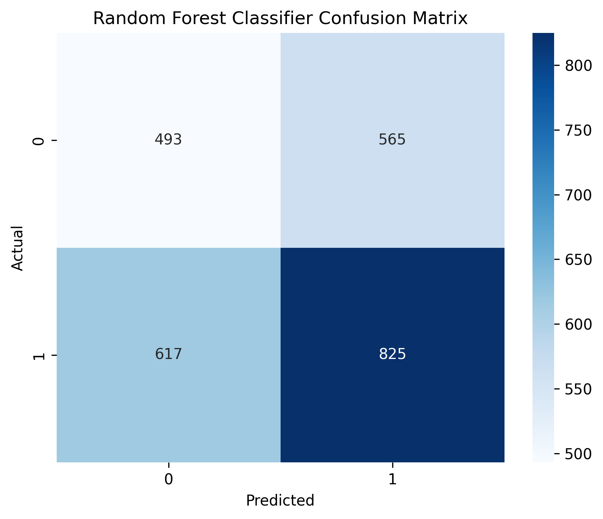
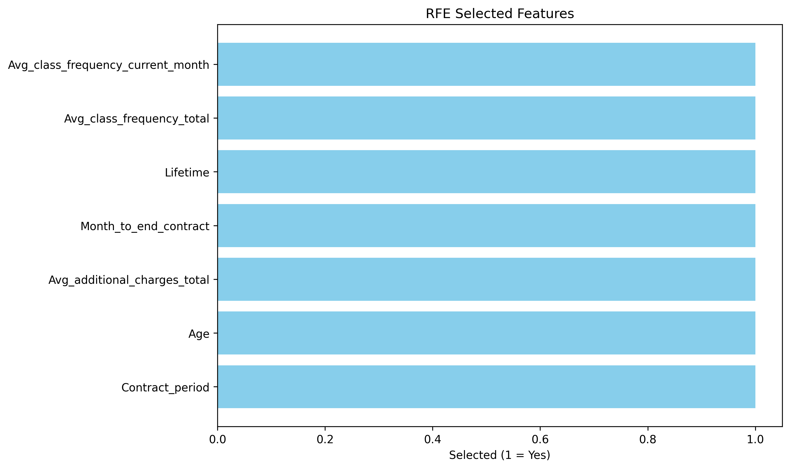
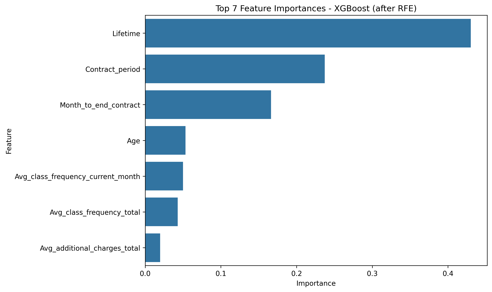
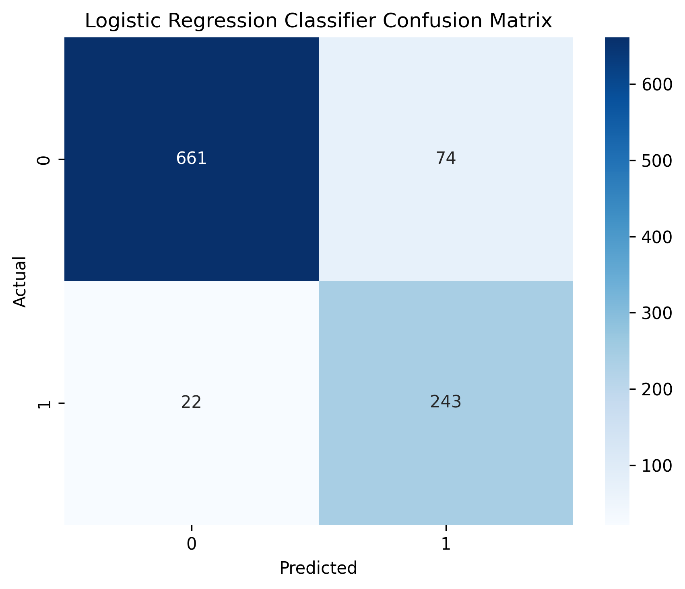

# pymc-marketing Portfolio

Junior AI/ML Engineer — Real-world data science and machine learning projects.

Currently completing Codecademy’s Data Scientist: Machine Learning Specialist path (certificate earned).

## Projects

### 1. Advertising Sales per Dollar Analysis
Efficiency of TV, Radio, and Newspaper ad spend.  
Key insight: Radio generates ~1.39 sales units per $1 (8x more efficient than TV).  
🔗 [View project](advertising/) | [Code](advertising/advertising_sales_per_dollar.py)

### 2. Auto Insurance Lead Conversion Prediction
Predict policy conversion from lead data (after fixing leakage in Time_to_Conversion).  
Top features: Credit_Score, Source_of_Lead, Claims_Frequency.  
🔗 [View project](auto_insurance/) | [Code](auto_insurance/auto_insurance_analysis.py)

### 3. Gym Membership Churn Prediction
Predict member cancellation using attendance, contract, and demographic data.  
🔗 [View project](gym_churn/) | [Code](gym_churn/gym_churn_prediction.py)

More projects coming soon.

Open to junior/entry-level Data Scientist or ML Engineer roles (remote preferred).

Connect: [LinkedIn](https://www.linkedin.com/in/joseph-argabrite-ii) | Email: Josephargabrite@gmail.com

# Advertising Sales Per Dollar Analysis

Junior AI/ML Engineer in training — building real-world data science projects with Pandas and Matplotlib.

## Project Overview

Analyzed the classic Advertising dataset (Kaggle) to evaluate efficiency of TV, Radio, and Newspaper ad spend in generating sales.

**Goal**: Determine which channel delivers the most sales units per dollar invested.

**Dataset**: 200 observations with ad spend (TV, Radio, Newspaper) and resulting sales revenue.

**Key Insights**:
- **Radio** is the most efficient channel: ~1.39 sales units generated per $1 spent
- **Newspaper** close behind: ~1.32 units per $1
- **TV** is least efficient per dollar: ~0.17 units per $1 (despite highest total spend)

This suggests reallocating budget toward Radio could maximize sales efficiency.

**Files**:
- `advertising.csv` — raw data
- `advertising_sales_per_dollar.py` — main analysis code (Pandas + Matplotlib)
- `sales_per_dollar.png` — bar chart visualization

**Skills Demonstrated**:
- Data loading and cleaning with Pandas
- Feature engineering (sales per dollar calculation)
- Aggregation and summary statistics
- Professional data visualization with Matplotlib
- Insight extraction and business value from real marketing data
- Exploratory Data Analysis (EDA)

**Next Projects**:
- Insurance cost modeling
- Customer churn modeling
- RAG Chatbot

## Visualizations

Learning via Codecademy Data Scientist: Machine Learning Specialist path (certificate earned).

## Auto Insurance Conversion Prediction

**Goal**: Predict whether an insurance lead will convert to a policy (binary classification: 1 = converted, 0 = did not) using personal auto insurance data.

**Dataset**: Synthetic Personal Auto Line of Business data from Kaggle — includes demographics, policy details, claims history, premium adjustments, and lead source.

**Key Challenge & Discovery**  
Initial Random Forest model achieved near-perfect performance (accuracy ~99%, ROC-AUC ~0.99). Upon inspection, **feature importance** revealed that `Time_to_Conversion` dominated (importance >90%).  

This column contains information **only available after conversion** occurs (e.g., 99 days for non-converters), creating **severe target leakage**. Removing it was essential to produce an honest model.

**Approach After Leakage Removal**  
- Encoded categorical features (Marital_Status, Policy_Type, Region, etc.) using LabelEncoder  
- Standardized numeric features with StandardScaler  
- Applied Recursive Feature Elimination (RFE) with Logistic Regression to select the top features  
- Trained and compared three classifiers on RFE-selected features: Random Forest, Decision Tree, AdaBoost  
- Evaluated with accuracy, classification report, ROC-AUC, and confusion matrices  

**Results**  
After removing the leaky feature and using RFE-selected predictors, model performance became realistic:  
- Test accuracy: ~52–57% (near random baseline due to mild class imbalance and limited predictive signal)  
- ROC-AUC: ~0.53 (no meaningful separation)  
- Top features (post-RFE): Credit_Score, Source_of_Lead, Premium_Amount, Claims_Frequency, Age  

**Business & Domain Insights**  
- The synthetic dataset lacks strong predictive power for conversion after removing leakage — real insurance conversion is driven by factors like quote follow-up, agent interaction, and external credit/risk data not fully captured here.  
- My insurance agency experience highlights that lead quality (e.g., agent vs online) and credit history are key — aligning with the top features found.

**Files**  
- `synthetic_insurance_data.csv` — raw data  
- `auto_insurance_analysis.py` — full analysis (EDA, encoding, scaling, RFE, model comparison)  
- `rfe_selected_features.png` — RFE-selected features bar plot  
- `feature_importance_auto_insurance.png` — Top feature importances after RFE  
- `Ada_Boost_Classifier_confusion_matrix.png` — AdaBoost Confusion Matrix
- `Decision_Tree_Classifier_confusion_matrix.png` — Decision Tree Confusion Matrix
- `Random_Forest_Classifier_confusion_matrix.png` — Random Forest Confusion Matrix

**Skills Demonstrated**  
- Data cleaning & preprocessing  
- Categorical encoding (LabelEncoder)  
- Feature scaling (StandardScaler)  
- Feature selection (RFE)  
- Model comparison (Random Forest, Decision Tree, AdaBoost)  
- Full classification evaluation (accuracy, precision/recall/F1, ROC-AUC, confusion matrix)  
- Leakage detection & correction  
- Business-domain interpretation (insurance-specific insights)  

Full repo: [github.com/JosephArgabrite/pymc-marketing](https://github.com/JosephArgabrite/pymc-marketing)

## Visualizations

**RFE Selected Features**

**Top Feature Importances after RFE (Random Forest)**

**Confusion Matrix - Random Forest**

## Gym Membership Churn Prediction

**Goal**: Predict whether a gym member will churn (cancel their membership) in the next month using customer and behavioral data.

**Dataset**: Gym Customer Features and Churn (Kaggle) — includes demographics, membership details, attendance patterns, and additional charges.

**Approach & Key Discoveries**  
Started by adapting my auto insurance analysis pipeline (encoding, scaling, RFE, model comparison) to this new churn task.

Initial full-feature Random Forest achieved very high performance (ROC-AUC ~0.97). However, RFE consistently ranked three features low (`Group_visits`, `Partner`, `gender`), suggesting limited predictive power.

Experimented with feature selection:
- Full set (14 features): ROC-AUC ~0.97 (but potentially overfitting to weak/noisy features)
- Top 7 features: Best balance — reduced false positives/negatives across models
- Top 3 features: Performance dropped ~5% (too much information loss)

**Final Results (Top 7 Features)**  
After RFE and model comparison:
- **Random Forest**: Recall (churn) = 81%, F1 = 84%
- **Logistic Regression**: Recall (churn) = 92%, F1 = 84% (best at catching churners)
- **XGBoost**: Recall (churn) = 87%, F1 = 88% (best overall balance)

These are strong results for a churn task — especially recall on the minority class (churners), which is critical for targeted retention efforts.

**Business Insights** (tied to my experience)  
- Low attendance frequency and short contract periods are major churn drivers — members who visit infrequently or have short-term contracts cancel at much higher rates.
- High additional charges correlate with churn — price sensitivity plays a big role.
- These findings align with real gym operations: retention programs should focus on increasing class attendance and offering flexible long-term contracts.

**Tech Stack**  
Python, Pandas, Scikit-learn (LabelEncoder, StandardScaler, RFE, Random Forest, Logistic Regression, AdaBoost), XGBoost, evaluation (ROC-AUC, precision/recall/F1, confusion matrix, feature importance).

**Files**  
- `gym_churn/gym_churn_us.csv` — raw data  
- `gym_churn/gym_churn_prediction.py` — full analysis (EDA, preprocessing, RFE, model comparison)  
- `gym_churn/gym_churn_images/feature_importance_gym_churn.png` — top feature importances  
- `gym_churn/gym_churn_images/Random_Forest_Classifier_confusion_matrix.png` — Random Forest Confusion Matrix
- `gym_churn/gym_churn_images/Logistic_Regression_Classifier_confusion_matrix.png` — Logistic Regression Confusion Matrix
- `gym_churn/gym_churn_images/XGBoost_Classifier_confusion_matrix.png` — XGBoost Confusion Matrix

## Visualizations

**RFE Selected Features**

**Top Feature Importances after RFE**

**Confusion Matrix - Random Forest**

**Next Steps**  
- Experiment with SMOTE or other imbalance techniques  
- Add hyperparameter tuning (GridSearchCV)  
- Explore deep learning models (neural nets)

Full repo: [github.com/JosephArgabrite/pymc-marketing](https://github.com/JosephArgabrite/pymc-marketing)

